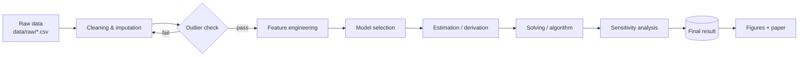

# Research Paper Figure Cookbook

Paste-ready, **publication-grade** figure templates for scientific papers (journal / conference). All templates produce **PDF + PNG + SVG**, use the shared `paper_style()` preset, and load data from a file path — never inline.

**Rule**: copy a template, change the data source + labels, run. Do not hand-edit individual rcParams per figure.

**But templates only get you to "correct".** The default target is **publication-grade — a figure a top-journal editor accepts with no revision request**, not "the data is plotted and readable". Before touching a template, read **§0b (the quality bar — what separates a publication-grade figure from an ordinary one)**; for a paper's hero / method figure read **§I (composition paradigms)**, **§J (aesthetic craft spec)**, **§K (original TikZ mechanism figures)**. Archetypes A1–A13 are the *floor*, not the ceiling.

---

## §0b The quality bar — publication-grade vs ordinary, on four axes

> **An ordinary figure = the data is plotted correctly and legible. A publication-grade figure = a reader stops on the page, and a skeptical reviewer/editor cannot fault it.** The gap lives on four axes; **miss one and it is merely "fine", not publication-grade.** "Plotted correctly" is the floor, not the target.

**Axis 1 — Depth (the figure argues a mechanism, not just displays data)**
- An ordinary figure answers "what" (here is a curve); a publication-grade one answers "why + so what" (the curve crosses the threshold at the marked line; the CI band widens in the extrapolation region — the *source* of uncertainty is drawn on the figure).
- Visualize the **generating mechanism**: mark the phase-transition / critical point with a line, annotate the inflection, shade the decision regions, draw the actual *distribution shape* (not just mean points).
- **Test**: cover the caption — is the claim still readable from the figure alone? If yes → deep enough.

**Axis 2 — Elegance (one figure, one claim; maximal data-ink)**
- Ordinary: a 2×2 equal grid, four unrelated panels, reader unsure where to look. Publication-grade: one **hero panel** carries the headline, the rest shrink to serve it; every drop of ink serves that one claim; the eye is led to the one signal by annotation / arrow / highlight.
- **Drop test**: delete a panel — is the claim much weaker? If not → delete it (see §0a). Equal grids are almost always wrong.

**Axis 3 — Unimpeachable (carries its own uncertainty + falsifiability + reproducibility)**
- A skeptic's three questions must be answered *on the figure*: **where is the uncertainty** (CI band / error bars)? **what is N** (annotated per series)? **can I reproduce it** (vector source + script + seed)?
- And: colorblind-safe (deuteranopia-distinguishable), **legible in grayscale** (redundant marker / linestyle encoding — reviewers often print B&W), axes not misleading (bars start at 0, dual axes only when physically linked).

**Axis 4 — Visible gap (looks a tier above at first glance)**
- Composition borrowed from journals (Nature / IEEE / Cell / MDPI method-figure layouts), disciplined typography (size hierarchy, aligned grid, white space) — within 0.5 s it reads as "this came from a paper, not a homework set". This is an *instant* signal, before the content is even parsed.

**One-line self-check**: hand the figure to the most demanding reviewer — can they find one "yes, but…"? (axis missing units / no uncertainty shown / mush in grayscale / a decorative panel / hero figure is a generic flowchart). If yes → not there yet; return to the four axes and close that gap.

**Difference from "plotted correctly is enough"**: correct = no risk of misreading (defense); publication-grade = a memorable highlight + nothing to attack (offense). We want the latter. **Axes 1+2 are the source of the highlight; axes 3+4 are the source of "unimpeachable".**

---

## §0a Figure Contract template (write BEFORE plotting)

Save as `outputs/figures/<name>_contract.md` next to each figure script. Pattern from Nature-figure standard:

```yaml
figure_id: fig2_main_allocation
core_claim: "<ONE sentence the figure must defend>"
backend: matplotlib  # matplotlib | tikz — pick one; do not cross-render
panels:
  - id: a
    type: sorted_bar
    defends: "ranking of 6 categories"
  - id: b
    type: heatmap
    defends: "pairwise correlation reveals confounder X"
archetype: quantitative_grid  # | schematic_composite | image_plate_quant | mixed
hierarchy:
  overview: "where reader looks first"
  deviation: "the surprising/key signal"
  relationship: "how variables connect"
hero_panel: a   # the one that carries the headline; others shrink
export: [pdf, svg, png]
source_data: data/processed/allocation.csv
stats_on_figure: "95% CI as error bars; N annotated per bar"
```

**Drop test**: if a panel cannot defend a unique sub-claim, delete it. Equal-sized 2×2 grids are usually wrong — pick one hero, shrink the others (e.g., `figsize=(7, 4)` with `gridspec_kw={'width_ratios': [2, 1]}`).

---

## §0 Shared style preset (`paperfig.style` — the single source of truth)

The preset lives in the **`paperfig`** package (`paperfig/style.py`; `scripts/_style.py` is a back-compat shim). Don't re-paste or fork it (it drifts). Its interface:

```python
from _style import paper_style, save, PALETTE, MARKERS, LINESTYLES

# Call ONCE at the top of every figure script. font: 'sans'(default, most
# journals' submission spec) | 'serif'(Times) | 'cn'(SimSun, Chinese papers).
PALETTE, MARKERS, LS = paper_style(font='sans')
# ... plot ...
save(fig, 'fig1_main_result')   # writes PDF + PNG + SVG to outputs/figures/
```

What the preset guarantees (so you never hand-tune rcParams per figure):
- **Editable vector**: `svg.fonttype='none'`, `pdf.fonttype=42` → text stays text in SVG/PDF, fixable in Illustrator/Inkscape without re-rendering.
- **300 dpi**, tight bbox, white canvas (no grey-on-Word transparent PNG).
- **Colorblind-safe palette** (`PALETTE`, Wong-derived) + `MARKERS` + `LINESTYLES` for redundant B&W-legible encoding.
- Soft near-black ink (not pure `#000`), top/right spines off, ticks inward, minor ticks on, subtle grid behind data, semi-opaque legend box, `axes.unicode_minus=False`.
- Three-format export via `save()` (PDF + PNG + SVG); override with `save(fig, name, formats=('pdf',))`.

> If you start a fresh project without this repo, copy `scripts/_style.py` verbatim — it *is* the preset. The archetypes below assume it is importable.

---

## §A Archetypes

> **Two ways to use these.** Most are available as **callable functions** in the
> installable `paperfig` package — `from paperfig import timeseries_ci, sorted_bar,
> grouped_bar, residual_diag, heatmap, scatter_fit, pareto, tornado, confusion,
> phase_portrait, alignment_scatter`. Each returns `(fig, ax)` so you tweak then
> `save(fig, name)`. The code blocks below show what each does and how to customize;
> prefer the function, drop to the snippet when you need something bespoke.

### A1 — Time series with confidence band

For: prediction trajectories, fitted curves vs observed, dynamics.

```python
import numpy as np, pandas as pd, matplotlib.pyplot as plt
from _style import paper_style, save, PALETTE
PALETTE, _, _ = paper_style()

df = pd.read_csv('data/processed/pred.csv')  # cols: t, y_obs, y_hat, lo, hi
fig, ax = plt.subplots(figsize=(7, 3.2))
ax.fill_between(df['t'], df['lo'], df['hi'], color=PALETTE[0], alpha=0.18, label='95% CI')
ax.plot(df['t'], df['y_hat'], color=PALETTE[0], label='Predicted')
ax.plot(df['t'], df['y_obs'], 'o', color=PALETTE[1], ms=3, label='Observed')
ax.set_xlabel('Time $t$')
ax.set_ylabel('Value $y_t$')
ax.legend(loc='upper left')
save(fig, 'fig1_final_demand_prediction')
plt.close(fig)
```

### A2 — Sorted bar (ranking)

For: ranked allocations, top-k items, sorted contributions.

```python
df = pd.read_csv('outputs/tables/allocation.csv').sort_values('share', ascending=True)
fig, ax = plt.subplots(figsize=(5, max(2.5, 0.22*len(df))))
ax.barh(df['name'], df['share'], color=PALETTE[0], edgecolor='white', linewidth=0.5)
ax.set_xlabel('Share')
ax.set_ylabel('')
for i, v in enumerate(df['share']):
    ax.text(v + 0.005, i, f'{v:.2%}', va='center', fontsize=8)
save(fig, 'fig2_final_allocation_ranked')
plt.close(fig)
```

### A3 — Grouped bar (multi-model comparison)

```python
df = pd.read_csv('outputs/tables/model_metrics.csv')  # cols: model, RMSE, MAE, MAPE
models = df['model'].tolist()
metrics = ['RMSE', 'MAE', 'MAPE']
x = np.arange(len(models)); w = 0.25
fig, ax = plt.subplots(figsize=(6, 3.2))
for i, m in enumerate(metrics):
    ax.bar(x + (i-1)*w, df[m], w, label=m, color=PALETTE[i], edgecolor='white', lw=0.4)
ax.set_xticks(x); ax.set_xticklabels(models)
ax.set_ylabel('Error')
ax.legend(ncol=3, loc='upper right')
save(fig, 'fig1_compare_models')
plt.close(fig)
```

### A4 — Residual plot (model diagnostic)

```python
df = pd.read_csv('outputs/tables/residuals.csv')  # y_hat, resid
fig, (ax1, ax2) = plt.subplots(1, 2, figsize=(7, 3))
ax1.scatter(df['y_hat'], df['resid'], s=8, color=PALETTE[0], alpha=0.6)
ax1.axhline(0, color='k', lw=0.6, ls='--')
ax1.set_xlabel('Fitted $\\hat y$'); ax1.set_ylabel('Residual $e$')
ax2.hist(df['resid'], bins=30, color=PALETTE[0], edgecolor='white')
ax2.set_xlabel('Residual'); ax2.set_ylabel('Count')
save(fig, 'fig1_diag_residual')
plt.close(fig)
```

### A5 — Heatmap (sensitivity / correlation / matrix)

```python
import seaborn as sns
M = pd.read_csv('outputs/tables/sens_matrix.csv', index_col=0)
fig, ax = plt.subplots(figsize=(5.2, 4.2))
sns.heatmap(M, cmap='RdBu_r', center=0, annot=True, fmt='.2f',
            cbar_kws={'label': 'Relative change'}, linewidths=0.3, ax=ax,
            annot_kws={'size': 8})
ax.set_xlabel('Parameter'); ax.set_ylabel('Output metric')
save(fig, 'fig3_sens_heatmap')
plt.close(fig)
```

### A6 — Scatter with regression / decision boundary

```python
from sklearn.linear_model import LinearRegression
df = pd.read_csv('data/processed/xy.csv')
m = LinearRegression().fit(df[['x']], df['y'])
xs = np.linspace(df['x'].min(), df['x'].max(), 100)
fig, ax = plt.subplots(figsize=(4.5, 3.2))
ax.scatter(df['x'], df['y'], s=10, color=PALETTE[0], alpha=0.6, label='Observed')
ax.plot(xs, m.predict(xs.reshape(-1,1)), color=PALETTE[1],
        label=f'$y={m.coef_[0]:.3f}x+{m.intercept_:.3f}$')
ax.set_xlabel('$x$'); ax.set_ylabel('$y$'); ax.legend()
save(fig, 'fig1_diag_scatter_fit')
plt.close(fig)
```

### A7 — Pareto frontier (multi-objective)

```python
df = pd.read_csv('outputs/tables/pareto.csv')  # cols: obj1, obj2, is_pareto
fig, ax = plt.subplots(figsize=(4.5, 3.5))
ax.scatter(df.loc[~df['is_pareto'],'obj1'], df.loc[~df['is_pareto'],'obj2'],
           s=6, color='lightgray', label='Dominated')
pf = df[df['is_pareto']].sort_values('obj1')
ax.plot(pf['obj1'], pf['obj2'], 'o-', color=PALETTE[1], ms=4, label='Pareto frontier')
ax.set_xlabel('Cost')
ax.set_ylabel('Risk')
ax.legend()
save(fig, 'fig3_final_pareto')
plt.close(fig)
```

### A8 — Tornado / sensitivity ranking

```python
df = pd.read_csv('outputs/tables/tornado.csv')  # param, low, high, base
df = df.assign(span=lambda d: d['high']-d['low']).sort_values('span')
fig, ax = plt.subplots(figsize=(5.2, max(2.5, 0.3*len(df))))
y = np.arange(len(df))
ax.barh(y, df['high']-df['base'], left=df['base'], color=PALETTE[0], label='+perturbation')
ax.barh(y, df['low']-df['base'],  left=df['base'], color=PALETTE[1], label='-perturbation')
ax.set_yticks(y); ax.set_yticklabels(df['param'])
ax.axvline(df['base'].iloc[0], color='k', lw=0.6, ls='--')
ax.set_xlabel('Objective value'); ax.legend()
save(fig, 'fig4_sens_tornado')
plt.close(fig)
```

### A9 — Confusion matrix (classification)

```python
from sklearn.metrics import confusion_matrix
import seaborn as sns
y_true = pd.read_csv('outputs/tables/cls_true.csv')['y']
y_pred = pd.read_csv('outputs/tables/cls_pred.csv')['y']
labels = sorted(set(y_true))
cm = confusion_matrix(y_true, y_pred, labels=labels)
fig, ax = plt.subplots(figsize=(3.6, 3.2))
sns.heatmap(cm, annot=True, fmt='d', cmap='Blues', cbar=False,
            xticklabels=labels, yticklabels=labels, ax=ax)
ax.set_xlabel('Predicted'); ax.set_ylabel('True')
save(fig, 'fig2_final_confusion')
plt.close(fig)
```

### A10 — Phase portrait (ODE / dynamics)

```python
from scipy.integrate import solve_ivp
def f(t, z): x, y = z; return [y, -0.3*y - np.sin(x)]
fig, ax = plt.subplots(figsize=(4.5, 3.8))
for x0 in np.linspace(-3, 3, 9):
    for y0 in np.linspace(-2, 2, 5):
        sol = solve_ivp(f, [0, 20], [x0, y0], max_step=0.05, dense_output=False)
        ax.plot(sol.y[0], sol.y[1], color=PALETTE[0], lw=0.5, alpha=0.6)
ax.set_xlabel('$x$'); ax.set_ylabel('$\\dot x$')
ax.set_xlim(-4, 4); ax.set_ylim(-2.5, 2.5)
save(fig, 'fig2_diag_phase_portrait')
plt.close(fig)
```

---

## §B Schematics (architecture / flowcharts)

**Hero-figure bar**: a paper's main architecture / method figure **must not be a generic flowchart**. The A11/A12 templates below are for *minor* flowcharts only; a hero schematic must use a domain-specific, journal-grade composition (embed the real method object: distribution, transform, decision region; borrow journal composition, redraw original) — see §I and §G.

### A11 — Mermaid flowchart (preferred, for minor flows)

Write to `assets/flow_pipeline.mmd`, render via Mermaid CLI or VS Code extension:



Render: `mmdc -i flow_pipeline.mmd -o flow_pipeline.pdf -b transparent --width 1400`
Include in LaTeX: `\includegraphics[width=\linewidth]{assets/flow_pipeline.pdf}`

### A12 — TikZ flowchart (LaTeX-native)

```latex
\usepackage{tikz}
\usetikzlibrary{shapes.geometric, arrows.meta, positioning}
\tikzset{
  block/.style={rectangle, draw, rounded corners, minimum height=8mm, minimum width=22mm, align=center, font=\small},
  dec/.style={diamond, draw, aspect=2, align=center, font=\small},
  arr/.style={-Latex, thick}
}
\begin{tikzpicture}[node distance=10mm and 14mm]
  \node[block] (data) {Raw data};
  \node[block, right=of data] (clean) {Clean};
  \node[dec,   right=of clean] (q) {OK?};
  \node[block, right=of q] (feat) {Features};
  \node[block, below=of feat] (model) {Model};
  \node[block, left=of model] (deriv) {Derivation};
  \node[block, left=of deriv] (solve) {Solve};
  \draw[arr] (data) -- (clean);
  \draw[arr] (clean) -- (q);
  \draw[arr] (q) -- node[above]{yes} (feat);
  \draw[arr] (q) -- node[left]{no} ++(0,-1.2) -| (clean);
  \draw[arr] (feat) -- (model);
  \draw[arr] (model) -- (deriv);
  \draw[arr] (deriv) -- (solve);
\end{tikzpicture}
```

### A13 — Network graph (small graph problems)

```python
import networkx as nx
G = nx.read_edgelist('data/processed/edges.txt', nodetype=int)
pos = nx.spring_layout(G, seed=42)
fig, ax = plt.subplots(figsize=(4.5, 4))
nx.draw_networkx_edges(G, pos, ax=ax, alpha=0.4, width=0.6)
nx.draw_networkx_nodes(G, pos, ax=ax, node_size=80, node_color=PALETTE[0])
nx.draw_networkx_labels(G, pos, ax=ax, font_size=7)
ax.set_axis_off()
save(fig, 'fig3_network')
plt.close(fig)
```

---

## §C Multi-panel composition

When a single subproblem needs 3–4 related views, use one composite figure (saves page count, improves narrative):

```python
fig, axes = plt.subplots(2, 2, figsize=(7, 5.5))
# axes[0,0]: data overview
# axes[0,1]: model fit
# axes[1,0]: residual
# axes[1,1]: sensitivity
for ax, label in zip(axes.flat, ['(a)','(b)','(c)','(d)']):
    ax.text(0.02, 0.96, label, transform=ax.transAxes, fontweight='bold', va='top')
plt.tight_layout()
save(fig, 'fig1_composite_overview')
plt.close(fig)
```

Caption: `Figure 1. (a) Raw data; (b) model fit; (c) residual diagnostics; (d) parameter sensitivity.`

---

## §D Tables → paper

Generate LaTeX tables from CSV via pandas (do NOT type-set by hand):

```python
df = pd.read_csv('outputs/tables/model_metrics.csv')
df = df.round({'RMSE': 3, 'MAE': 3, 'MAPE': 2})
df.style.format(precision=3).hide(axis='index').to_latex(
    'paper/tables/t_metrics.tex',
    column_format='lrrr',
    hrules=True,
    caption='Error metrics of each model on the test set.',
    label='tab:metrics',
    position='htbp',
)
```

Then in main text: `\input{tables/t_metrics.tex}`.

---

## §E LaTeX figure inclusion (paper-side)

Single figure:
```latex
\begin{figure}[htbp]
  \centering
  \includegraphics[width=0.7\linewidth]{figures/fig1_main_result.pdf}
  \caption{Filled circles are observations, the blue line is the model prediction, and the shaded band is the 95\% confidence interval.}
  \label{fig:pred}
\end{figure}
```

Side-by-side:
```latex
\begin{figure}[htbp]
  \centering
  \begin{subfigure}{0.48\linewidth}
    \includegraphics[width=\linewidth]{figures/fig1_diag_residual.pdf}
    \caption{Residuals}\label{fig:resid}
  \end{subfigure}\hfill
  \begin{subfigure}{0.48\linewidth}
    \includegraphics[width=\linewidth]{figures/fig1_diag_scatter_fit.pdf}
    \caption{Fit}\label{fig:fit}
  \end{subfigure}
  \caption{Model diagnostics.}\label{fig:diag}
\end{figure}
```

Reference in text: `as shown in Fig.~\ref{fig:pred}`, never just "the figure below".

---

## §F Reproducibility checklist

Per figure script:

- [ ] reads data from a file path (no inline data > 20 rows)
- [ ] calls `paper_style()` once
- [ ] uses palette colors, not raw color names
- [ ] saves PDF + PNG + SVG via `save()`
- [ ] writes a stdout line `[fig] saved ...`
- [ ] is rerun-stable (random seed if randomness used)
- [ ] registered in `outputs/figures/figure_manifest.csv`

---

## §G What NOT to do (auto-penalty patterns)

| Anti-pattern | Why penalized | Fix |
|---|---|---|
| 3D bar / pie chart | low data-ink ratio, hard to read | A2 sorted bar |
| Dual y-axis with no physical link | misleading | split into two panels |
| Rainbow colormap | not perceptually uniform | viridis / RdBu_r |
| Default matplotlib style (off-brand font, blue/orange, top-right spines) | reads as a homework plot, not a paper | call `paper_style()` |
| Missing-glyph boxes (☐☐☐) for CJK / special chars | broken render | `paper_style(font='cn')` + install the font; keep math in mathtext |
| Inline tiny legends overlapping data | unreadable | move legend out, or use direct labels |
| Saving only PNG at 72 dpi | grainy in print | `save()` produces 300 dpi PDF + PNG + SVG |
| Figure with no body-text interpretation | counted as decoration | add 2–3 sentences before/after |
| Same color/marker for different things | confusion | one (color, marker, ls) tuple per series |
| AI-generated image for "method architecture" | unreproducible, banned | original TikZ (§K) or Mermaid (A11) |
| Hero/architecture figure that reads as a generic boxes-and-arrows flowchart | reviewers score it as filler, indistinguishable from every other paper — the most common schematic failure | make the hero figure domain-specific: embed actual method objects (distributions, transforms, decision regions), borrow journal composition, redraw original (not screenshot). A11/A12 are fallbacks for *minor* flowcharts only |

---

## §H Quick decision tree

```
Need a figure?
├── Is it the paper's HERO / method figure? → STOP. §0b axes → §I paradigm (P1–P6) → §J craft → §K TikZ.
│                                              Do NOT reach for A11/A12 (those are MINOR flowcharts only).
├── Showing time-evolution? → A1 (TS+CI) or A10 (phase)
├── Comparing models? → A3 (grouped bar)
├── Ranking items? → A2 (sorted bar)
├── Matrix-shaped data? → A5 (heatmap)
├── Two-objective tradeoff? → A7 (Pareto)
├── Parameter influence? → A8 (tornado) or A5 (heatmap)
├── Classifier output? → A9 (confusion)
├── Model diagnostic? → A4 (residual) + A6 (scatter+fit)
├── Minor workflow / sub-flowchart? → A11 (Mermaid) or A12 (TikZ)
├── Graph structure? → A13 (networkx)
└── 3–4 views of one subproblem? → §C composite (pick a hero, don't equal-grid — §0b axis 2)
```

**Every archetype above is the floor.** After plotting, run the §0b four-axis self-check before declaring a figure done. A figure that merely "plots the data correctly" is an ordinary figure, not a publication-grade one.

---

## §I Hero / method-figure composition paradigms (imitable, journal-grade)

> **The most common failure** of a paper's hero/method figure is degenerating into a generic boxes-and-arrows flowchart — a reviewer reads it as filler, indistinguishable from every other paper. But "don't do X" doesn't teach you to do Y. Below are **6 imitable composition skeletons** distilled from real journal method figures (Nature Methods / IEEE / Cell / MDPI). Integrity rule: **borrow the composition, redraw it original — never screenshot**.

Each paradigm gives: **when to use / skeleton / the real method object to embed / implementation route**.

### P1 — Horizontal pipeline + endpoint circles + central hero band (pipeline-with-hero)
- **When**: the method has a clear "input → several stages → output" backbone and one stage is the core contribution.
- **Skeleton**: left circle (input data/source) → row of rectangular stage blocks → **[central highlighted hero band: your contribution, set off by color/border/fill]** → right circle (output / headline number). A bypass lane on top (online / feedback / streaming), a **guarantee band** below (theorem / metric anchored under the relevant block).
- **Embed the real object**: in the hero band, **don't write the words "domain adaptation"** — draw the actual source/target scatter + the alignment before/after (motif P5); in the output circle write the **real number** (e.g. AUROC 0.94).
- **Implement**: TikZ standalone (§K), compiled to PDF then `\includegraphics` — zero compile risk to the main document.

### P2 — Top/bottom paradigm swimlanes (paradigm swimlanes)
- **When**: the method spans two paradigms (mechanistic vs data-driven / source vs target domain / training vs inference) and you want the reader to see at a glance that you stitched the two together.
- **Skeleton**: two horizontal lanes, each holding that paradigm's blocks; a **"bridge" node** in the middle (your fusion point) connects top and bottom. The bridge is where the contribution lives.
- **Embed**: lane labels are the real paradigm names; the bridge node draws the fusion mechanism (weighting $w$ / alignment / shared parameter).

### P3 — Left/right before-after (transform diptych)
- **When**: the core contribution is "a transform makes the hard problem easy" (alignment, dimensionality reduction, normalization, pre/post a phase transition).
- **Skeleton**: left panel = before (tangled / inseparable / unaligned), a large central arrow labeled with the **transform name + key metric** (e.g. "−42% MMD"), right panel = after (clean / separable / aligned).
- **Embed**: both sides are **real data scatter / distributions**, not schematic blobs. This is the most persuasive method figure — it directly *proves* the transform works.

### P4 — Distribution-flow axis (distribution-flow)
- **When**: degradation / diffusion / uncertainty-propagation problems where the quantity is a **distribution evolving over time**, not a point.
- **Skeleton**: time on the x-axis; at each key time draw that moment's distribution vertically (violin / ridgeline / density ridge), overlaid with the mean trajectory + CI band.
- **Embed**: the real density at each stage, a threshold line crossing through, and the **first-passage / event-time distribution drawn at the right margin**.

### P5 — Source-target alignment motif (source-target alignment)
- **When**: transfer learning / domain adaptation / batch-effect removal.
- **Skeleton**: source scatter (color 1) + target scatter (color 2) in one feature plane; the alignment (CORAL / MMD / Harmony / …) shown as an arrow or a before/after pair; **highlight the overlap region after alignment**, annotated with the distance metric.
- **Implement**: real reduced-dimension scatter in matplotlib (PCA / t-SNE / UMAP) — no need to schematize; or embed real coordinates in TikZ (§K K2).

### P6 — Decision-region map (decision-region map)
- **When**: classification / staging / threshold decisions.
- **Skeleton**: the feature plane shaded by decision (e.g. negative / borderline / positive regions), real samples overlaid, the boundary is your classifier/criterion; key threshold lines annotated with their **meaning**.
- **Embed**: the real threshold value, the decision regions, and where real samples actually land.

**Discipline shared by all 6 paradigms**:
- **Shape encodes semantics, consistently**: endpoints (input/output) = circles, processing = rectangles, decisions = diamonds.
- **The hero element must be visually heaviest** (size / saturation / border); everything else restrained (§J data-ink).
- **Real method object > text label**: if you can draw the distribution, don't write the word "distribution". This is the single lever that turns a "generic flowchart" into a "domain method figure".
- Borrow the composition, redraw it original, never screenshot.

---

## §J Journal-grade aesthetic craft (the craft spec)

> Same data — a journal figure and a homework figure differ on these **quantifiable** crafts. Each is a hard spec, not a taste preference.

**J1 Color**
- Use the §0 colorblind-safe 6-color palette; sequential data → `viridis`, diverging data (signed, with a center) → `RdBu_r`; **never jet/rainbow**.
- ≤6 series → qualitative palette; >6 → rethink (you probably should split or aggregate).
- **Grayscale-redundant encoding**: color + marker + linestyle, so every series stays distinguishable in a B&W print (reviewers often print B&W).
- **One color = one meaning**: a given quantity keeps one color throughout (e.g. "observed" is always `PALETTE[1]`).
- Saturated for emphasis, low-saturation/gray for context; hero uses pure color, context uses muted.

**J2 Type & spacing**
- **Four-level size hierarchy**: title 11 / axis-label 10.5 / tick 9 / annotation 8 — not all one size.
- In-figure font ≥ ~80% of body-text size (ticks still legible after scaling to column). **Anti-pattern**: large figsize + tiny font → blurry after `includegraphics` scaling.
- Font matches the body: English journals use Arial/Helvetica (sans — most submission specs require it) or Times (serif); math via mathtext `cm`/STIX. Switch with `paper_style(font=...)`.
- ≤2 font families per figure (one text + one math); never mix three.

**J3 data-ink (Tufte)**
- Remove all non-data ink: drop top/right spines (set in §0), no grid unless necessary, **no 3D**, no shadows/gradients/decorative borders.
- For each element ask: **does it encode data?** No → delete.
- Higher data-ink ratio is better; a chart's "decorativeness" is inversely correlated with its tier.

**J4 White space & layout**
- Don't cram: margin around panels, space between elements; density = cheap look.
- **Unequal sizing**: the hero panel takes ~60–70% of the area, context panels shrink. e.g. `gridspec_kw={'width_ratios':[2,1]}`.
- **Aligned grid**: all panels' axes, labels, legend left edges / baselines aligned (`constrained_layout` or manual gridspec). Visible misalignment is the detail that most cheapens a figure.

**J5 Annotation as narrative**
- Write the **claim on the figure**: arrow + short label pointing at the key signal ("inflection @ $t$=12 h", "threshold $\theta_c$", "$p<0.001$").
- **Direct labeling > legend**: with few series, label at the line end — saves the eye from ping-ponging between legend and curve.
- Annotate the key numbers (peak, crossing, threshold crossing) so the figure carries its own conclusion (echoes §0b axis 1).
- But restrained: annotation serves **one** claim, not a pile.

**J6 Honest axes**
- Bar charts: $y$ starts at 0 (truncation misleads); line charts may not start at 0 but say so.
- Dual axes only when the two quantities are physically linked and both labeled; otherwise split into two panels.
- Axis labels carry **unit + symbol**: "Time $t$ (s)", not a bare `t`.
- Use a log axis across orders of magnitude, and mark it log.

---

## §K Original vector mechanism figures (TikZ, embedding real method objects)

> Why a hero figure goes TikZ instead of matplotlib: **vector journal quality + fonts matched to the body text + standalone compile = zero risk to the main document + original & reproducible (no AI-generated images)**. This section is the technique for embedding *real method objects* into TikZ — i.e. the implementation layer for §I P1–P6.

### K0 Engineering skeleton (standalone, compiled independently)
```latex
\documentclass[tikz,border=2mm]{standalone}
\usepackage{times}           % match body font (or \usepackage{helvet}\renewcommand\familydefault{\sfdefault} for sans journals)
% \usepackage{ctex}          % uncomment only if the figure contains Chinese
\usetikzlibrary{positioning, arrows.meta, fit, backgrounds,
                decorations.pathmorphing, shapes.geometric}
\begin{document}
\begin{tikzpicture}[
  io/.style={circle, draw, minimum size=11mm, align=center, font=\small},
  proc/.style={rectangle, draw, rounded corners, minimum height=9mm,
               minimum width=20mm, align=center, font=\small},
  hero/.style={rectangle, draw=red!60, line width=1pt, fill=red!4,
               rounded corners, align=center},
  arr/.style={-{Latex[length=2mm]}, thick},
]
  % ... nodes + edges
\end{tikzpicture}
\end{document}
```
Compile `pdflatex schematic.tex` (or `xelatex` if using ctex) → PDF → in the paper `\includegraphics[width=\linewidth]{figures/schematic.pdf}`. **The main document never touches `tikzpicture` → zero compile risk.**

### K1 Draw the real distribution inside a node (don't write the word "distribution")
Inside the hero node, use explicit `plot coordinates` to draw two density curves (source/target), overlaid in different colors to show the gap:
```latex
\draw[blue, smooth] plot coordinates {(0,0)(.5,.4)(1,1)(1.5,.4)(2,0)};   % source density
\draw[red,  smooth] plot coordinates {(.6,0)(1.1,.4)(1.6,1)(2.1,.4)(2.6,0)}; % target (offset = domain gap)
```

### K2 A transform arrow that carries meaning (P3/P5 motif)
The arrow doesn't just connect — it **carries the metric**; scatter real point clouds inside the before/after nodes, overlapping after alignment:
```latex
\foreach \i in {1,...,30}{ \fill[blue!60] (rnd*1.2, rnd*1.2) circle (.4pt); } % source cloud
\draw[arr] (before) -- node[above,align=center]{align\\ MMD$\downarrow$42\%} (after);
```

### K3 Shade decision regions (P6)
```latex
\fill[green!10]  (0,0) rectangle (3,1);   % region A (e.g. negative)
\fill[orange!10] (0,1) rectangle (3,2);   % region B (e.g. borderline)
\fill[red!10]    (0,2) rectangle (3,3);   % region C (e.g. positive)
\draw[dashed] (0,2) -- (3,2) node[right]{$\theta_c$};   % threshold + its meaning
\foreach \p in {(.5,.4),(1.2,.8),(2.1,2.3)}{ \fill[black] \p circle (.6pt); } % real samples
```

### K4 Swimlanes via fit (P2)
```latex
\begin{scope}[on background layer]
  \node[fit=(a)(b)(c), draw, fill=blue!3, inner sep=3mm, label=left:{mechanistic}] {};
\end{scope}
```

### K5 Guarantee band
Anchor a small node just below a stage block (theorem / metric / N) so the method figure doubles as the paper's structure map:
```latex
\node[font=\scriptsize, below=1mm of model] {Thm.\,2};
```

**TikZ anti-pattern**: nodes containing only text labels → degenerates into the §B A12 generic flowchart. **At least one hero node must embed a real method object** (distribution / scatter / decision region / before-after), otherwise don't draw it — this is §0b axis 1 and the §I shared discipline applied at the TikZ layer.

---

## §L External template library index (optional, curated)

> An optional external plotting-template library can serve as a **design reference**. Set its location once in `CLAUDE.md` (`<TEMPLATE_LIB>`); if you don't have one, skip this section. **Position: design reference (borrow composition / palette / chart type), not drop-in.** Figures in this system are always matplotlib + TikZ, `paper_style()`, three-format, reproducible — **external MATLAB/R/Origin templates are never pasted into the paper**; they are imitation targets: study their composition/palette/chart-type, then **redraw original** in matplotlib/TikZ via §I/§J/§K.

**Curated filter — what to use, what not** (sub-paths relative to `<TEMPLATE_LIB>`):

| Sub-library (example) | Grade | Use |
|---|---|---|
| MATLAB high-end plotting set (`.m` + `data.mat` + preview) | ★ paper-grade | 60+ chart types, SCI-level. **First choice reference** |
| R template set (incl. 50 SCI figures + code) | ★ paper-grade | raincloud / violin / regression variants etc. |
| Python source templates | ○ partial | pick non-chartjunk (scatter / hist / line / contour); **skip pie** |
| Journal figure-spec docs (10 publishers' instructions) | ★ journal spec | resolution / font-size / CMYK submission hard-specs — **the authoritative external anchor for §J** |
| Excel chart packs (pie / gauge / 3D / donut) | ✗ chartjunk | **never** — these are exactly the §G anti-patterns; low data-ink, illegible in B&W |
| PPT/medical decoration art | ✗ off-topic | decorative, non-reproducible — ignore |

**Chart types the library adds beyond A1–A13** (imitate, then redraw in matplotlib when P4 etc. needs them):

| Needed figure | Paradigm | What to imitate from `<TEMPLATE_LIB>` |
|---|---|---|
| violin / ridgeline / raincloud | §I P4 distribution-flow | violin, ridgeline, raincloud templates |
| density scatter with regression trend | A6 scatter+fit (upgraded) | density-scatter-with-regression template |
| error-band line | A1 time series + CI (upgraded) | error-line template |
| correlation block / bubble heatmap | A5 heatmap (upgraded) | correlation-block / bubble-heatmap templates |
| radar | multi-metric comparison (use sparingly, ≤1) | radar template |
| Sankey | §I P1 flow-type hero | sankey template |
| windrose | directional data | windrose template |

**Call discipline**: ① first look in A1–A13 + §I; for a chart type the cookbook lacks, consult `<TEMPLATE_LIB>`. ② imitate = learn composition/palette/chart-type, then **redraw original in matplotlib/TikZ** — never paste MATLAB/R output into the paper (breaks reproducibility). ③ never reference the chartjunk / off-topic sub-libraries.

---

## §M Origin as a disciplined front-end (optional)

> **Position**: the default route is still matplotlib + §K TikZ. Origin is **conditionally allowed** as a plotting front-end, but its default workflow (point-and-click GUI, binary `.opj` project, not re-runnable by a reader) **fails the reproducibility bar** — so it must wear the M1–M6 guardrails below, which constrain it to "journal-spec + vector three-format + reproducible fallback". **Fail a guardrail → fall back to matplotlib.**

**When Origin is worth it**: you (or a coauthor) are faster in Origin, or you need an SCI chart that is hard in matplotlib and is Origin's strength (certain multi-axis heatmaps / complex overlays), and the figure is **not the hero** (the hero always goes §K TikZ).

**M1 Same-source data**: Origin must **import** from `data/processed/*.csv` (the same file matplotlib uses). **Never type data into Origin by hand**; if data changes, re-import — do not edit values inside Origin.

**M2 Journal-spec template (.otp)**: build one Origin Template once that locks the §J hard specs — font matched to body text, size hierarchy (axis-label / tick), line width, colorblind palette, no top/right spines, ticks inward. Then **every figure inherits that template** — no per-figure hand-tuning (the §0 "don't hand-edit per figure" rule). Source the spec numbers from a journal figure-spec doc (`<TEMPLATE_LIB>` §L, or the target journal's author guidelines).

**M3 Vector three-format export**: `Export Graphs` → PDF (vector) + PNG (300 dpi) + SVG, named per §0 convention `figN_<short-name>`, into `outputs/figures/`. **Never export PNG raster only.** Export settings: embed fonts; width to column (single ≈ 8.4 cm / double ≈ 17.4 cm, per the journal's spec).

**M4 Reproducible fallback (hard requirement)**: every Origin figure ships with something that can redraw it, one of:
- (a) save the `.opj` project to `outputs/figures/origin_proj/` + one README line recording "from which CSV, which .otp";
- (b) **better**: add a matplotlib equivalent script under `scripts/`, so anyone without Origin can regenerate the figure from the data.
- **Every key result figure must have (b)** (reproducibility); decorative/minor figures may have only (a).

**M5 Register**: log it in `outputs/figures/figure_manifest.csv` with a `generation` column = `origin:<otp>` + the data-source path, keeping traceability.

**M6 Hero red line**: the paper's hero / method figure **does not go through Origin** (Origin struggles with the §I real-method-object composition) → stays §K TikZ. Origin only makes A1–A13 standard figures + the Origin-strength chart types in §L.

**Self-check**: an Origin figure **still passes the §0b four axes + §F reproducibility checklist** — Origin is not an excuse to lower the bar; it must still be colorblind-safe, B&W-legible, carry its own uncertainty, be vector. Fail the four axes → fall back to matplotlib.

**Anti-patterns**: ① typing data into Origin (breaks M1) ② PNG screenshot only (breaks M3) ③ no fallback script/project (breaks M4, not reproducible) ④ per-figure hand-tuning instead of the template (breaks M2, inconsistent) ⑤ using Origin for the hero flowchart (breaks M6).
