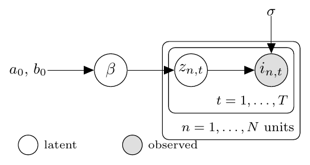
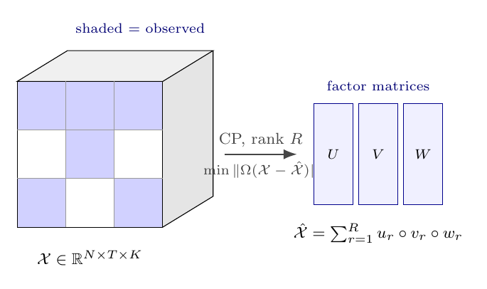
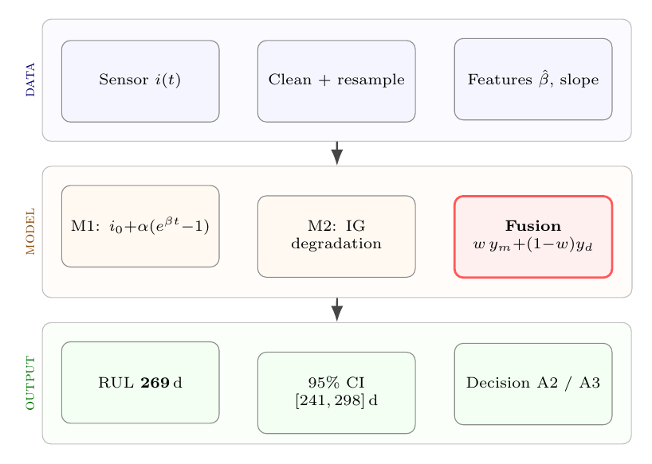

# Framework / method / architecture figures — the hero a paper opens with

The single figure a reviewer weighs hardest is the **framework figure** (a.k.a.
method figure, architecture figure, 技术路线图 / 模型框架图): the one that shows the
*whole approach* on one page. It is also the figure most papers get wrong — it
degenerates into a generic boxes-and-arrows flowchart (§G's most-penalized pattern)
that reads as filler. This reference is the deep-dive for getting it right: the
composition paradigms (§I) made concrete, with **curated external resources to
imitate** and **two complete, compilable worked heroes** to paste from.

> **Integrity rule (non-negotiable, = §L discipline).** Every resource below is an
> *imitation target*, not a paste source. Borrow the **composition / palette /
> chart-type**, then **redraw it original** in TikZ/matplotlib so the figure stays
> reproducible. Pasting a foreign PNG/slide into the paper breaks the reproducible
> hard rule even when the asset is MIT/free. When you adapt **code** (e.g. a TikZ
> snippet from tikz.net), keep it original-enough and credit the source in a `%` comment.

---

## Worked heroes in this repo (paste these, swap the content)

Five complete `standalone` TikZ figures — `pdflatex <file>.tex` → PDF →
`\includegraphics`, zero compile risk to the main document. The first two are
composition paradigms (§I); the last three are the T4 technique families:

| File | Shape | When to use |
|---|---|---|
| [`examples/hero_tikz/pipeline_hero.tex`](../../../../examples/hero_tikz/pipeline_hero.tex) | **P1** pipeline-with-hero | a clear input→stages→output backbone, one stage is the contribution |
| [`examples/hero_tikz/framework_hero.tex`](../../../../examples/hero_tikz/framework_hero.tex) | **P2** paradigm swimlanes | two paradigms fused (mechanistic + data-driven / source + target), the bridge is the contribution — the most common 数模/method-paper framework shape |
| [`examples/hero_tikz/graphical_model_hero.tex`](../../../../examples/hero_tikz/graphical_model_hero.tex) | **T4a** graphical model (`bayesnet`) | the contribution is a generative / hierarchical-Bayesian structure (latent vs observed, plates) |
| [`examples/hero_tikz/tensor_framework_hero.tex`](../../../../examples/hero_tikz/tensor_framework_hero.tex) | **T4b** data tensor (3-D block) | the object is a 3-D array that is factorized / completed (spatiotemporal, multi-sensor) |
| [`examples/hero_tikz/matrix_layout_hero.tex`](../../../../examples/hero_tikz/matrix_layout_hero.tex) | **T4c** matrix+fit map | a dense multi-stage method you want as one aligned "structure + result" overview |

`framework_hero.tex` is the reference implementation of the three techniques below
+ the §0b axis-1 rule: each lane embeds a **real method object** (a degradation
curve crossing its threshold; an actual MLP; the fusion's prediction lines), never
the *words* "mechanistic" / "neural net" / "fusion".

---

## Three borrowable TikZ techniques (distilled from tikz.net / Izaak Neutelings)

These are exactly what turns "loose boxes" into a journal-grade framework. All three
are demonstrated, commented, in `framework_hero.tex`.

### T1 — Colour-codes semantics, one style per role
Define one TikZ style per *semantic role* and let colour carry the meaning, so
input / process / output / contribution read at a glance:
```latex
io/.style    = {circle, draw=green!55!black, fill=green!8, ...},   % input
mech/.style  = {rectangle, draw=blue!55!black, fill=blue!5, ...},  % process (lane A)
data/.style  = {rectangle, draw=orange!75!black, fill=orange!7,...},% process (lane B)
hero/.style  = {rectangle, draw=red!65, line width=1pt, fill=red!5, ...}, % contribution
```
The hero style is visually heaviest (saturated border, fill) — §J's "hero must be
heaviest" at the TikZ layer.

### T2 — Loop-based node placement (don't hand-place)
Generate repeated structure (a network, a layer stack, a row of stages) with
`\foreach`, naming coordinates so you can connect them — compact and editable:
```latex
\foreach \L/\n/\c in {0/3/green!60!black, 1/4/orange!75!black, 2/2/black!55}{
  \foreach \i in {1,...,\n}{ \coordinate (N-\L-\i) at (\L*9mm, {(\i-(\n+1)/2)*3mm}); }}
% edges first, then nodes overlay them:
\foreach \i in {1,...,3}\foreach \j in {1,...,4} \draw[black!35,line width=.35pt] (N-0-\i)--(N-1-\j);
\foreach \L/\n/\c in {...}\foreach \i in {1,...,\n} \fill[\c] (N-\L-\i) circle (1.1pt);
```
*(Izaak's originals use `listofitems`' `\readlist\Nnod{4,5,5,5,3}` to make the
layer-size list itself a parameter — adopt that if you want one macro for many nets.)*

### T3 — `fit`/`background` grouping into named lanes
Group a stretch of blocks into a labelled "lane" with a `fit` node on the background
layer — this is what makes a swimlane (P2) read as two paradigms:
```latex
\begin{scope}[on background layer]
  \node[fit=(blockA)(blockB), draw=blue!40, fill=blue!3, rounded corners,
        inner sep=5mm, label={[font=\tiny]left:\rotatebox{90}{mechanistic}}] {};
\end{scope}
```
**Gotcha (learned the hard way, now commented in the example):** the background
layer sits *behind* node fills. Inter-block arrows on the background layer look
clean (they cross empty gaps), but a mini-network *inside a filled box* must be
drawn **in the main layer** (edges first, dots second) or the fill hides it.

### T4 — Three more families (from `xinychen/awesome-latex-drawing`, published-paper-grade)
When the framework's real object isn't a plain network, reach for one of these
instead of forcing it into boxes:
- **`bayesnet` library** — graphical-model / probabilistic frameworks: `\node[latent]`,
  `\node[obs]`, `\factor`, `\plate{}{}{}` give latent vs observed variables, factors,
  and **plates** (repetition over `N`). The right tool when the contribution is a
  generative/Bayesian structure, not a pipeline.
- **Parametrized 3-D block** — draw a **data tensor** as a framework input/stage
  (partially-observed array, tensor factorization). A plain-TikZ parallelepiped with
  the dims as `\newcommand`s (reused per block) is the robust route; `tikz-3dplot`
  generalizes it to arbitrary camera rotation. (Note: `\W`/`\H` are LaTeX accents —
  use a prefix like `\tW`/`\tH`.)
- **`\matrix` + `\usetikzlibrary{fit,calc}`** — lay framework components on an aligned
  grid, then `fit` a labelled box around a group (cleaner than manual `positioning` for
  a dense, multi-component framework — see their Example 25).

All open directly on Overleaf — read the source, redraw original.

**Each family has a compilable worked example in this repo** (paste, swap the content):
`graphical_model_hero.tex` (bayesnet), `tensor_framework_hero.tex` (3-D block),
`matrix_layout_hero.tex` (matrix+fit). All three carry a *real* object — a plate
structure, a partially-observed tensor, a result-bearing grid — not empty boxes:

| graphical model (T4a) | data tensor (T4b) | matrix+fit map (T4c) |
|---|---|---|
|  |  |  |

---

## Curated external resources (imitation targets — verified)

### Composition templates (borrow the layout, redraw original)
- **[dair-ai/ml-visuals](https://github.com/dair-ai/ml-visuals)** (MIT, 100+ visuals,
  Google Slides) — the best library of *method-figure compositions*: encoder-decoder,
  attention, pipeline, fusion layouts. Study how a good one leads the eye and places a
  hero; redraw the composition in TikZ. Do **not** export a slide into the paper.
- **[dvgodoy/dl-visuals](https://github.com/dvgodoy/dl-visuals)** (free w/ credit,
  200+ diagrams) — more architecture/layer variants to imitate.
- **[YupengQI99/awesome-ai-scientific-figures](https://github.com/YupengQI99/awesome-ai-scientific-figures)**
  — community-verified AI-tool + prompt combinations for paper figures (a different angle:
  *how to drive* an AI figure tool well). Use as a meta-reference, never paste its outputs.

### Reproducible TikZ technique (adapt the code, credit it)
- **[tikz.net — neural networks (Izaak Neutelings)](https://tikz.net/neural_networks/)**
  — source of T1–T3; ~1000 high-craft figures across the site
  ([author index](https://tikz.net/author/izaak/)).
- **[tikz.janosh.dev (Janosh Riebesell)](https://tikz.janosh.dev/)** — 115 reproducible
  ML + physics TikZ figures.
- **[HarisIqbal88/PlotNeuralNet](https://github.com/HarisIqbal88/PlotNeuralNet)** (MIT)
  — Python→LaTeX for layered CNN-style block stacks (the 3-D box architecture look).
- **[xinychen/awesome-latex-drawing](https://github.com/xinychen/awesome-latex-drawing)**
  (MIT, 2k★) — 30+ framework / graphical-model figures **taken from published papers**
  (IEEE TPAMI/TKDE/TRC), every one with Overleaf-openable source. The richest source of
  *paper-grade* framework exemplars; it also adds the three technique families in T4 below.
- **[PetarV-/TikZ](https://github.com/PetarV-/TikZ)** (MIT) — Petar Veličković's canonical
  ML PGF/TikZ collection (GNNs, attention, sequence models); the most-referenced starting
  point for ML method figures.
- **[fraserlove/nntikz](https://github.com/fraserlove/nntikz)** (TeX) — clean, consistent
  neural-network TikZ diagrams for academic reuse.
- **[battlesnake/neural](https://github.com/battlesnake/neural)** (on CTAN as
  `neuralnetwork`) — a ready-made LaTeX *package*: drop-in commands for layered net
  diagrams when you'd rather not hand-roll the T2 `\foreach`.

### Principles (verified)
- **[A Brief Guide to Designing Effective Figures (Rolandi et al.)](https://www.researchgate.net/publication/51682634_A_Brief_Guide_to_Designing_Effective_Figures_for_the_Scientific_Paper)**
- **[Simplified Science Publishing — method-figure selection](https://www.simplifiedsciencepublishing.com/resources/how-to-make-good-figures-for-scientific-papers)**
  (method figure → flowchart / Sankey / parallel-sets / timeline selection).
- **[jbmouret/matplotlib_for_papers](https://github.com/jbmouret/matplotlib_for_papers)**
  (2.2k★) — the classic hands-on handout for publication-quality matplotlib; general data
  figures rather than frameworks, but its typography / sizing discipline transfers directly.

---

## Build a framework figure — the route

1. **Pick the paradigm** (§I): one backbone + one hero stage → **P1**
   (`pipeline_hero.tex`); two paradigms fused → **P2** (`framework_hero.tex`);
   a transform makes a hard problem easy → **P3** diptych; distribution over time →
   **P4**; transfer/alignment → **P5**; classification regions → **P6**.
2. **Copy the matching worked hero**, swap the content: lane labels = your real
   paradigm names, the embedded objects = your real method objects, the output
   circle = your real headline number.
3. **Apply T1–T3** for any new repeated structure or grouping.
4. **Run the critique gate** conceptually (`references/figure-critique.md`): does a
   real method object live in the hero (axis 1)? is the hero visually heaviest
   (axis 2)? does it read journal not homework in 0.5 s (axis 4)? If the hero is
   still text-in-boxes, it is not a framework figure yet — go back to step 2.
5. **Compile standalone** (`pdflatex`), `\includegraphics` the PDF, register it in
   `outputs/figures/figure_manifest.csv` with `generation = tikz:<file>.tex`.
