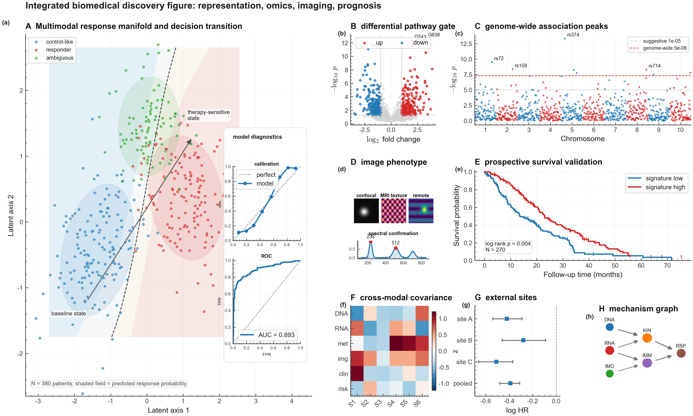
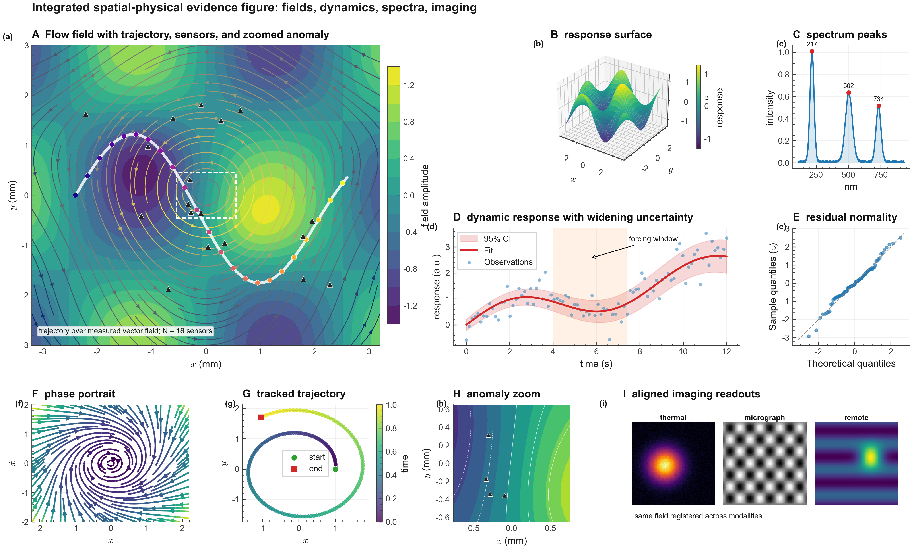
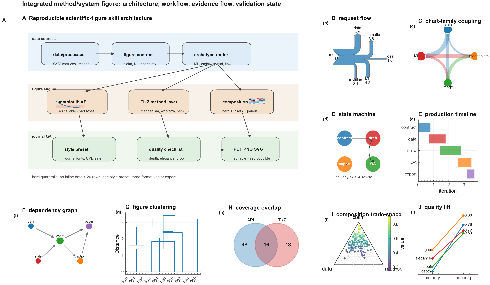
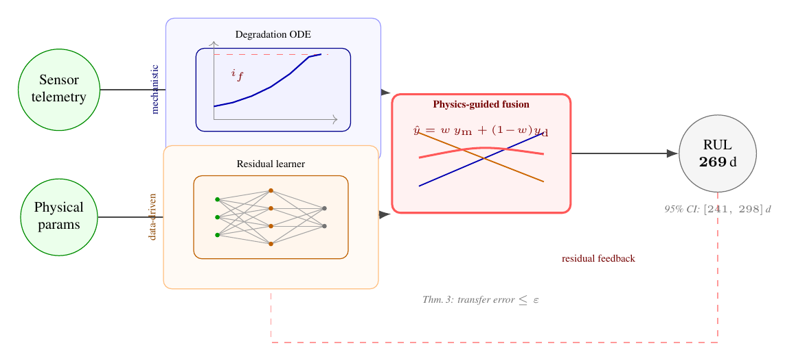

# paper-figures — a publication-grade figure system for scientific papers

[](https://github.com/TAO-QKV/paper-figures/actions/workflows/ci.yml)
[](LICENSE)


Turn "a dataset + a claim" into a **publication-grade figure** — the kind a top-journal editor accepts with no revision request. A self-contained Claude skill: reproducible matplotlib/seaborn plots for data figures, and original TikZ for hero/method figures.

## Example output

The point is not "many chart thumbnails"; it is complex paper figures with hierarchy, insets, cross-panel evidence, and honest uncertainty.

**Complex biomedical evidence panel** - a single integrated figure with a hero response manifold, decision field, calibration/ROC diagnostics, volcano + Manhattan omics evidence, imaging plate, survival validation, forest plot, covariance heatmap, and mechanism graph ([`examples/complex_panels.py`](examples/complex_panels.py)):



**Complex spatial-physical evidence panel** - field + streamline + trajectory + sensors as the hero panel, with response surface, spectrum, time-series uncertainty, QQ residual check, phase portrait, anomaly zoom, and registered imaging readouts:



**Complex method/system figure** - architecture, workflow, evidence flow, state machine, production timeline, dependency graph, clustering, set overlap, ternary trade-space, and quality-lift slopegraph:



**Framework / method hero figure (original, compilable TikZ)** - the figure a paper opens with: a two-paradigm framework (mechanistic + data-driven, fused at the contribution), with a *real* method object embedded in each lane (a degradation curve crossing its failure threshold, an actual MLP, the fusion's prediction lines) instead of text-in-boxes. One `pdflatex` away, zero compile risk to the main document ([`examples/hero_tikz/framework_hero.tex`](examples/hero_tikz/framework_hero.tex); see [`framework-figures.md`](.claude/skills/paper-figure-generation/references/framework-figures.md)):



Additional composite galleries are reproducible coverage examples, not the visual front door: [`showcase_gallery.py`](examples/showcase_gallery.py), [`coverage_gallery.py`](examples/coverage_gallery.py), [`domain_showcases.py`](examples/domain_showcases.py).

Lower-level API smoke/demo galleries are kept as regression checks rather than the visual front door: [`gallery.py`](examples/gallery.py), [`archetypes_gallery.py`](examples/archetypes_gallery.py), [`paradigms_gallery.py`](examples/paradigms_gallery.py), [`modern_gallery.py`](examples/modern_gallery.py), [`scientific_gallery.py`](examples/scientific_gallery.py), [`advanced_gallery.py`](examples/advanced_gallery.py), [`rich_gallery.py`](examples/rich_gallery.py), [`before_after.py`](examples/before_after.py).

## Quickstart (with Claude)

1. Put your data in `data/processed/your_data.csv`.
2. Open Claude in this folder and say:
   > Plot a figure from `data/processed/your_data.csv`; the claim is "Y declines linearly with X".
3. The `paper-figure-generation` skill triggers and produces:
   - a reproducible script `scripts/figN_<name>.py`
   - the figure in three formats `outputs/figures/figN_<name>.{pdf,png,svg}`
   - a caption that states the conclusion
   - a row in `outputs/figures/figure_manifest.csv`

## Use it as a library (no Claude needed)

```bash
pip install -e .          # or: pip install -e ".[extras]"  for pandas/seaborn/scipy
```

```python
import numpy as np
from paperfig import paper_style, save, timeseries_ci, scatter_fit, heatmap

paper_style(font='sans', journal='ieee')   # font: 'sans'|'serif'|'cn'; journal: None|'ieee'|'nature'|'pnas'

t = np.linspace(0, 10, 50); y = 1 - np.exp(-0.3 * t)
fig, ax = timeseries_ci(t, y + np.random.normal(0, .05, 50), y, y - .06, y + .06,
                        ylabel='Signal $y$')
ax.set_title('My result')                  # tweak the returned fig/ax freely
save(fig, 'fig1_main_result')              # → outputs/figures/fig1_main_result.{pdf,png,svg}
```

**48 callable chart types**, each returning `(fig, ax)` or `(fig, axes)`:

| Domain | Functions |
|---|---|
| core | `timeseries_ci`, `sorted_bar`, `grouped_bar`, `scatter_fit`, `heatmap`, `pareto`, `tornado` |
| distributions | `violin`, `raincloud`, `ridgeline`, `histogram`, `box`, `ecdf`, `qq`, `jointplot`, `hexbin_density` |
| ML / diagnostics | `roc_curve`, `pr_curve`, `calibration`, `confusion`, `residual_diag`, `feature_importance`, `convergence_curve`, `embedding_scatter`, `attention_map` |
| stats / comparison | `bar_err` (+ significance brackets), `bubble`, `forest`, `bland_altman`, `slopegraph`, `radar` |
| omics / genomics / medical | `volcano`, `manhattan`, `survival` (Kaplan-Meier) |
| fields / dynamics / spectra | `contour_field`, `streamplot_field`, `surface3d`, `phase_portrait`, `trajectory`, `spectrum`, `ternary` |
| structure / set / flow | `sankey`, `chord`, `dendrogram`, `network_graph`, `venn2` |
| imaging plates | `image_panel` (microscopy / medical / remote-sensing image panels with scalebars) |
| transfer / method | `alignment_scatter` (P5 motif) |

Best-fit route: quantitative and ML panels use the callable matplotlib API; mechanism / architecture / workflow figures use the TikZ composition paradigms; image-heavy evidence uses `image_panel` plus quantitative subpanels. Pie/donut charts are intentionally not highlighted because the cookbook treats them as low data-ink defaults; prefer sorted bars unless composition is the point.

- **Journal presets** — `paper_style(journal=...)` sets that publisher's single-column figure size + font sizes:

  | journal | 1-col width | journal | 1-col width | journal | 1-col width |
  |---|---|---|---|---|---|
  | `nature` | 89 mm | `cell` | 85 mm | `acs` | 3.33 in |
  | `science` | 57 mm | `pnas` | 87 mm | `rsc` | 83 mm |
  | `ieee` | 3.5 in | `elsevier` | 90 mm | `aps` | 86 mm |

  (From each publisher's public author guidelines — verify against the current guidelines, specs drift.)
- **LaTeX is optional** — figures render without a LaTeX install; opt in with `paper_style(tex=True)` for true LaTeX typography.

### Or just a matplotlib style (no API)

```python
import paperfig                 # registers the style name
import matplotlib.pyplot as plt
plt.style.use('paperfig')       # now any plt.* plot is publication-grade
```

## The idea

Publication-grade = the cookbook's **§0b four axes**, all true at once: **Depth** (the figure argues a mechanism) × **Elegance** (one figure, one claim) × **Unimpeachable** (carries its own uncertainty + reproducible) × **Visible gap** (reads journal-grade at a glance). Archetypes A1–A13 are the floor, not the ceiling.

## Relation to SciencePlots

[SciencePlots](https://github.com/garrettj403/SciencePlots) is the excellent, popular toolkit for matplotlib *styles* — and paperfig borrows its best ideas: a `plt.style.use('paperfig')` `.mplstyle`, cascading **journal presets**, and citability. The differences:

- **paperfig does not require LaTeX** (SciencePlots does); LaTeX is opt-in (`tex=True`).
- paperfig adds what a style sheet can't: a **quality bar** (§0b four axes), **hero/method-figure composition paradigms** (§I P1–P6), **callable archetype functions** (`timeseries_ci`, `alignment_scatter`, …), and **original TikZ** for method figures (§K).

Think of it as: *SciencePlots-style presets, plus the judgment and building blocks to make the figure itself publication-grade.* If you only want journal styles, SciencePlots is great; if you want the figure's content held to a bar, use paperfig.

## Layout

| Path | What |
|---|---|
| `paperfig/` | the installable package: `style.py` (preset) + `archetypes.py` (callable A1–A10 + P5) |
| `examples/` | runnable galleries (`complex_panels.py`, `showcase_gallery.py`, `coverage_gallery.py`, `domain_showcases.py`, `scientific_gallery.py`, `advanced_gallery.py`, `archetypes_gallery.py`, `paradigms_gallery.py`) + two complete compilable TikZ framework heroes (`hero_tikz/pipeline_hero.tex` = §I-P1, `hero_tikz/framework_hero.tex` = §I-P2 paradigm swimlanes) |
| `tests/` | pytest smoke tests (every archetype + three-format `save`) |
| `.claude/skills/paper-figure-generation/SKILL.md` | the Claude skill (triggers, hard rules) |
| `.../references/figure-cookbook.md` | **main reference**: §0b quality bar · §0a contract · §0 style · §A archetypes A1–A13 · §I composition paradigms P1–P6 · §J craft spec · §K original TikZ · §L external template library · §M Origin front-end |
| `.../references/figure-critique.md` | the **quality gate**: operationalizes the §0b four axes + worked before→after critiques |
| `.../references/framework-figures.md` | **framework/method-figure deep-dive**: two compilable hero examples + 3 borrowable TikZ techniques + curated resources |
| `.../references/caption-and-quality.md` | caption writing + final quality checklist |
| `scripts/critique.py` | runnable critique gate — static-analyses a figure script against the bar, exits non-zero on a hard-rule miss |
| `scripts/_style.py` | back-compat shim → `paperfig.style` |
| `data/processed/` · `outputs/figures/` | input data · output + `figure_manifest.csv` |
| `CLAUDE.md` · `pyproject.toml` | project role + `<TEMPLATE_LIB>` convention · packaging |

## Hard rules

Reproducible (a script reads data from a file; no inline data > 20 rows; no AI-generated images) · vector three-format (PDF + PNG + SVG) · style preset called once · colorblind- and grayscale-safe · units / N / uncertainty on the figure · pass the §0b four axes + §F reproducibility checklist before "done".

These are **enforced, not just exhorted**: `python scripts/critique.py scripts/figN_<name>.py` static-analyses a figure script against the bar — hard-rule misses (no uncertainty, jet colormap, equal grid, default style, PNG-only) come back as `FAIL` (non-zero exit, so it gates CI), and the judgment-half (does the figure argue a mechanism? does one hero panel dominate? B&W-legible?) prints as prompts you answer by hand. See [`references/figure-critique.md`](.claude/skills/paper-figure-generation/references/figure-critique.md).

## Requirements

Python 3.9+, `matplotlib`, `numpy`, `pandas`; `seaborn` for heatmaps; a LaTeX install with TikZ for §K hero figures (optional). See `requirements.txt`.

## License

[MIT](LICENSE) © 2026 TAO-QKV. Use it, fork it, adapt it for your papers.
